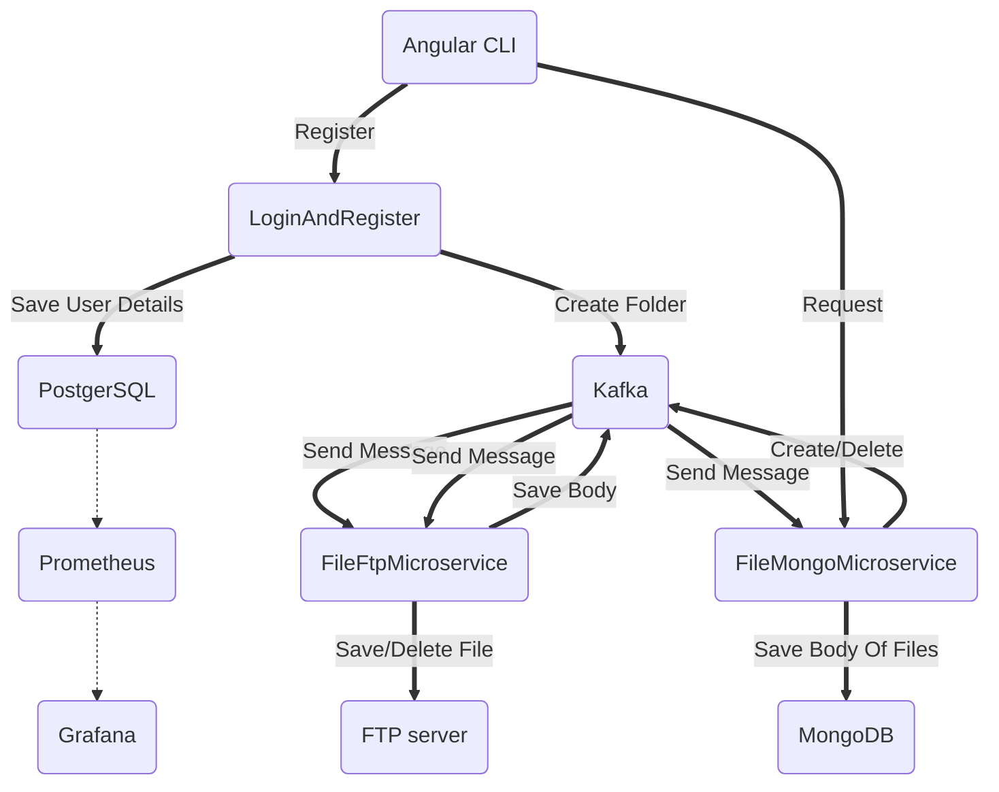

# ServiceFtp
This is a project which show my status of my knowledge in coding.

Technologies in my project:
1. Java
2. Spring Framework
3. ConfigServer
4. MongoDB
5. PostgreSQL
6. Vsftpd (FTP Server)
7. Docker
8. Kafka
9. Monitoring:
10. Prometheus 
11. Grafana

Links to code:
1. LoginAndRegister - [https://github.com/Daniel200555/LoginAndRegister](https://github.com/Daniel200555/LoginAndRegister)
2. FileFtpMicroservice - [https://github.com/Daniel200555/FileFtpMicroservice](https://github.com/Daniel200555/FileFtpMicroservice)
3. FileMongoMicroservice - [https://github.com/Daniel200555/FileMongoMicroservice](https://github.com/Daniel200555/FileMongoMicroservice)
4. Docker-Compose - [https://github.com/Daniel200555/runner](https://github.com/Daniel200555/runner)

Structure of microservices in my project:
1. [LoginAndRegister](https://github.com/Daniel200555/LoginAndRegister/blob/main/README.md)
2.  ![[FileFtpMicroservice]]
3. ![[FileMongoMicroservice]]
### In the next version:
1. I will finish my Front-End side
2. Add Elastic Search + Kibana
3. Create new microservice which will enabled to Redis (Cash Database)
4. Add share function of files or folders
5. Run microservices via Kubernetes (I want to try create replications for microservice) + LoadBalancer

Graf of structure my projects:

**I RUNNED ALL DATABASES AND KAFKA WITH GRAFANA IN VIRTUAL MASHINE**
